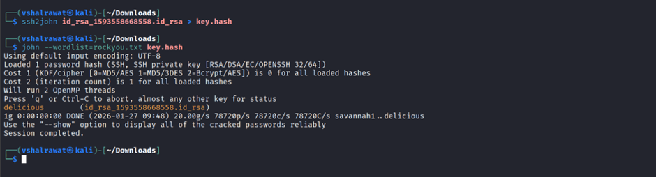
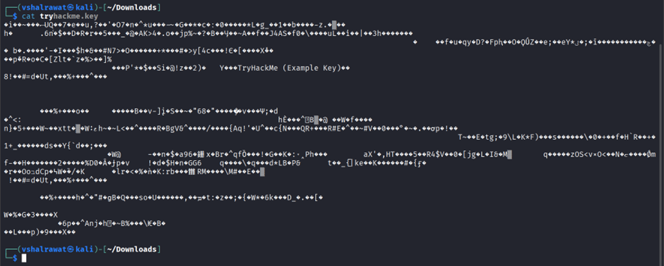
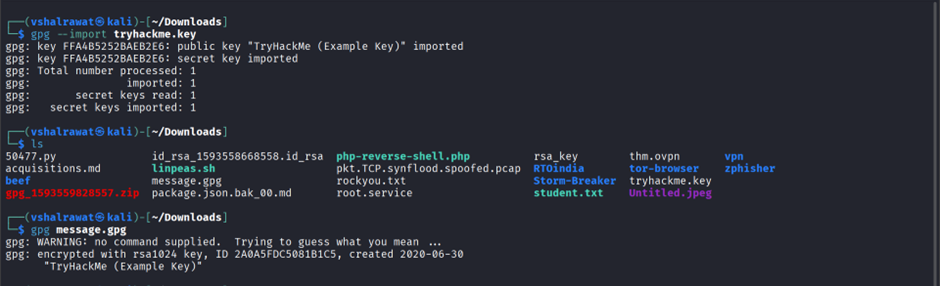

## **Encryption - Crypto 101**

### **Task-9**

```
ssh2john rsa_file > filename.hash
```

```
john --wordlist=<rockyou.txt path> filename.hash
```



### **Task-11**

Download task file

```
unzip <filename>
```

```
cat tryhackme.key
```



File is encrypted

```
gpg --import tryhackme.key
```

```
gpg message.gpg
```



```
cat message
```


