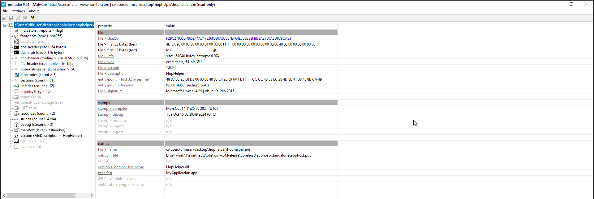
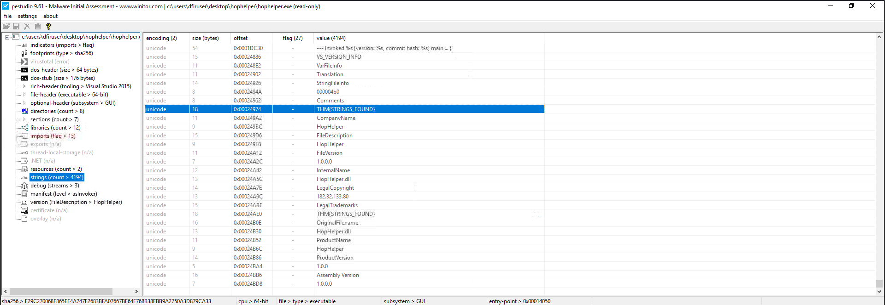
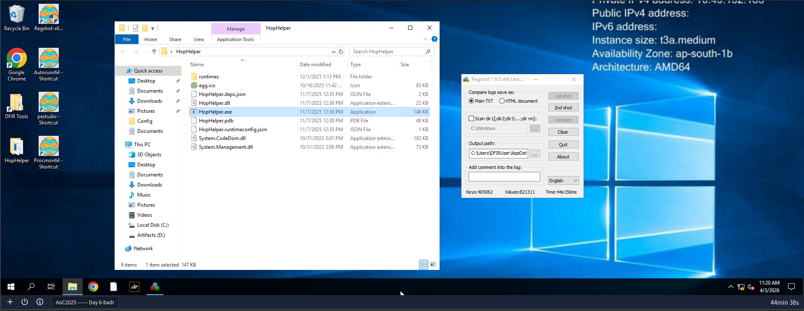
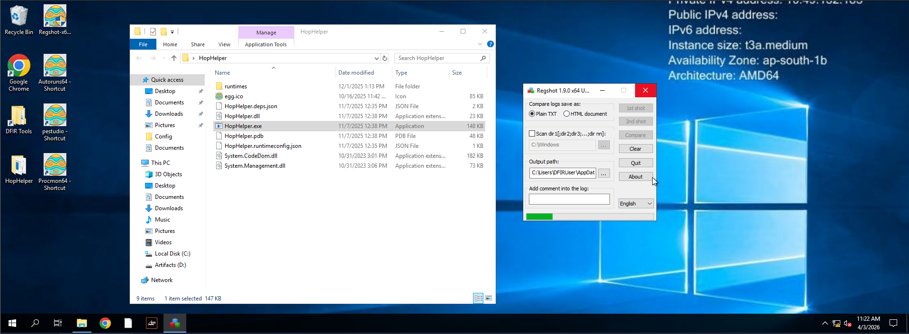
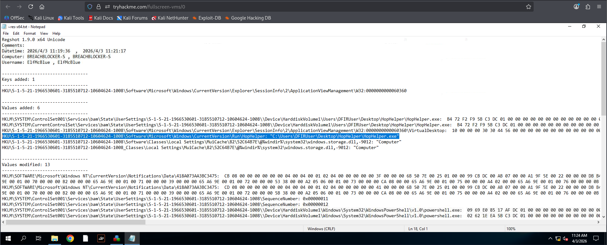
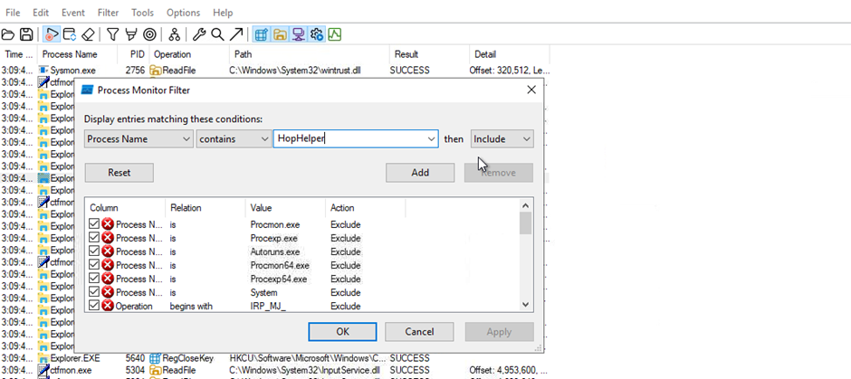
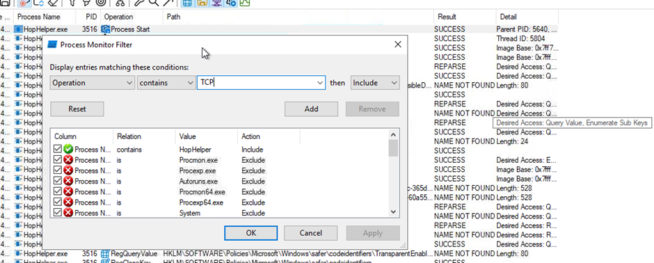
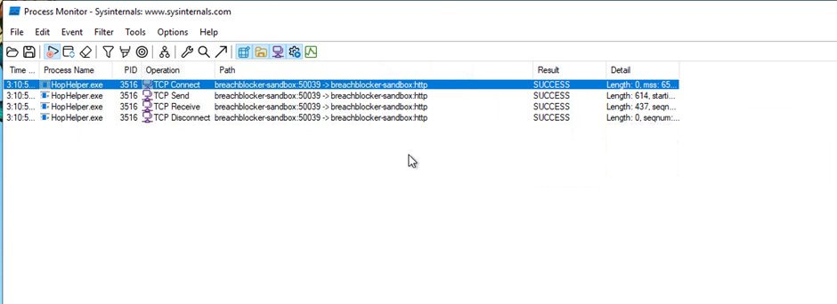

## Egg-xecutable

We are doing it in sandbox which protects our host machine from it

Username: ElfMcBlue

Password: TryH@cKMe1!

Inside folder HopHelper we have our malware

Open pestudio and drop the HopHelper.exe extension

We saw a SHA256 hash of file

Right Click à Copy value

This would help us to check if this hash value is seen before

On left side go to strings, over there we can find passwords, IP’s etc

Down there we will find our flag

### **Dynamic Analysis**

Now we are done with static analysis and now we will do dynamic analysis

For dynamic analysis run regshot

Change location to desktop to save to

Now click on 1st shot a Shot which takes a snapshot of machine

After this we will execute HopHelper and we see some changes

Now click on 2nd shot

Now click on Compare

Now after this we see results

Search for hop helper and we find that its interacting with machine and accesses our registeries

Now we will see everything with ProcMon

It shows us all the processes running

Our capture is on so we will run HopHelper

Click on filter on the top

Make these changes and Click ok

Now we will check regarding network activity so click on filter again

Make these changes and click ok

Now we are down to 4 things

